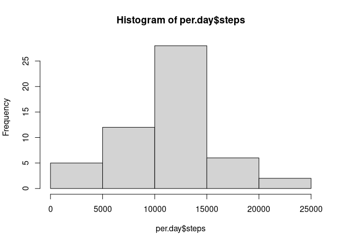
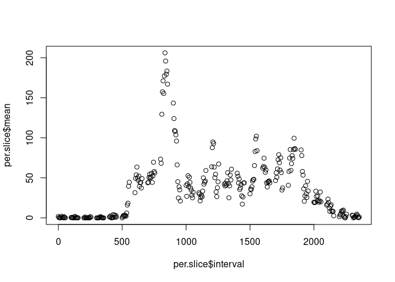
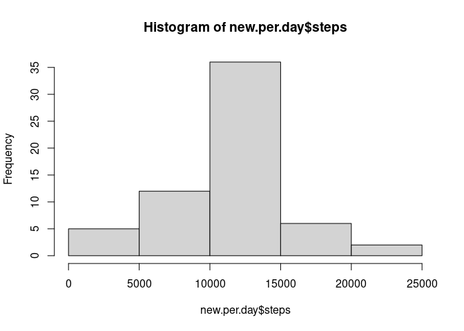
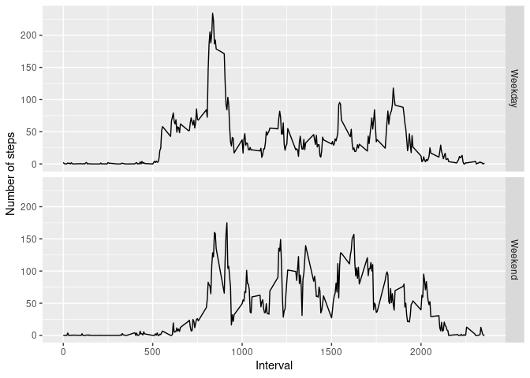

## Loading and preprocessing the data


```r
# Unzip data file and read in the csv
unzip("activity.zip")
data <-  tbl_df(read.csv("activity.csv")) %>%
           mutate(date=ymd(date))
```

```
## Warning: `tbl_df()` was deprecated in dplyr 1.0.0.
## Please use `tibble::as_tibble()` instead.
```


## What is mean total number of steps taken per day?

Calculate total number of steps taken per day:


```r
per.day <- data %>%
           filter(!is.na(steps)) %>%
           group_by(date) %>%
           summarize(steps=sum(steps))

per.day.mean <- mean(per.day$steps)
per.day.median <- median(per.day$steps)
```

Histogram of total steps for any given day:


```r
hist(per.day$steps)
```

<!-- -->

The mean number of steps per day is 10766.1886792.  The median is 10765.
  

## What is the average daily activity pattern?

Compare 5-minute the average number of steps taken for each time interval, averaged across all days


```r
per.slice <- data %>%
    filter(!is.na(steps)) %>%
    group_by(interval) %>%
    summarize(mean=mean(steps))

plot(per.slice$interval, per.slice$mean)
```

<!-- -->

The 5 minute interval with the maximum average number of steps is 835.


## Imputing missing values


```r
complete.data <-  complete.cases(data)

total.rows <- dim(data)[1]
complete.rows <- sum(complete.data)
incomplete.rows <- total.rows - complete.rows
```

Of 17568 rows, 15264 were complete and 2304 had missing values.


```r
new.data <- inner_join(data, per.slice, by = "interval") %>%
                  mutate(steps=ifelse(is.na(steps), mean, steps)) %>%
                  select(steps,date, interval)

new.per.day <- new.data %>%
           group_by(date) %>%
           summarize(steps=sum(steps))

hist(new.per.day$steps)
```

<!-- -->

```r
new.per.day.mean <- mean(new.per.day$steps)
new.per.day.median <- median(new.per.day$steps)
```

The mean after imputing data steps per day is 10766.1886792 (vs. 10766.1886792 before). This didn't change because we added values matching the existing mean for each 5 minute bucket, adding perfectly average days to the data.

The median after imputing data is 10766.1886792 (vs. 10765 before). This went up a little because the added data disproportionately displaced entries lower than the 50th percentile.


## Are there differences in activity patterns between weekdays and weekends?


```r
per.slice <- data %>%
    filter(!is.na(steps)) %>%
    mutate(weekend=factor(ifelse(weekdays(date) %in% c("Saturday","Sunday"),"Weekend","Weekday"))) %>%
    group_by(weekend, interval) %>%
    summarize(mean=mean(steps))
```

```
## `summarise()` has grouped output by 'weekend'. You can override using the `.groups` argument.
```

```r
g <- ggplot(per.slice, aes(interval, mean))

g + geom_line() + facet_grid(weekend ~ .) + xlab("Interval") + ylab("Number of steps")
```

<!-- -->
